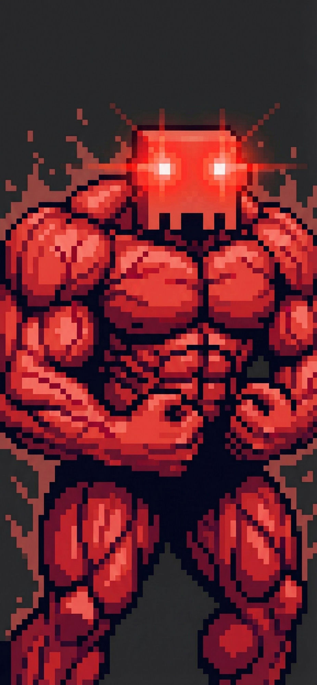
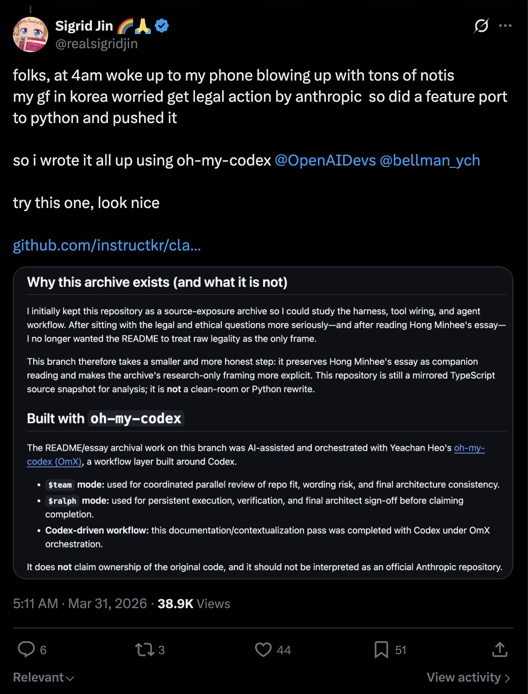
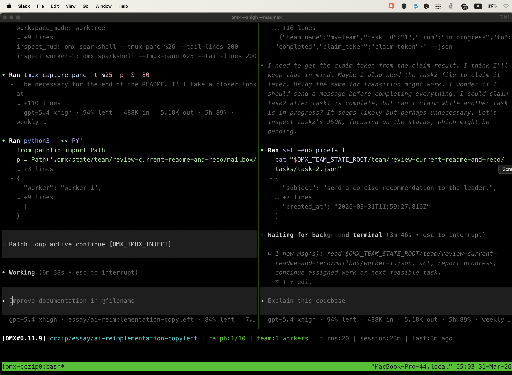
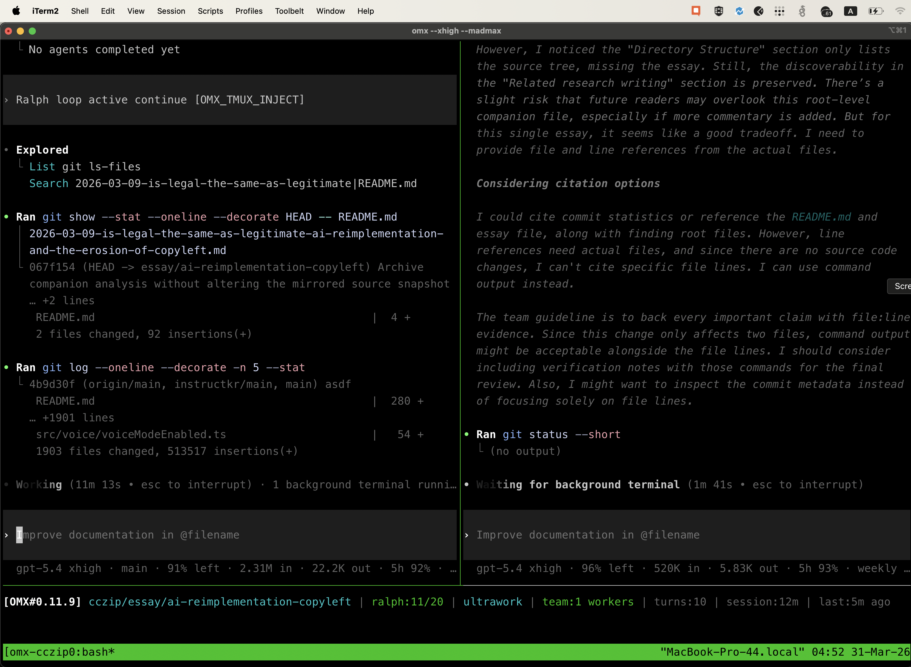

# Rewriting Project Claw Code

<p align="center">
  <strong>⭐ The fastest repo in history to surpass 50K stars, reaching the milestone in just 2 hours after publication ⭐</strong>
</p>

<p align="center">
  <a href="https://star-history.com/#ultraworkers/claw-code&Date">
    <picture>
      <source media="(prefers-color-scheme: dark)" srcset="https://api.star-history.com/svg?repos=ultraworkers/claw-code&type=Date&theme=dark" />
      <source media="(prefers-color-scheme: light)" srcset="https://api.star-history.com/svg?repos=ultraworkers/claw-code&type=Date" />
      
    </picture>
  </a>
</p>

<p align="center">
  
</p>

<p align="center">
  <strong>Autonomously maintained by lobsters/claws — not by human hands</strong>
</p>

<p align="center">
  <a href="https://github.com/Yeachan-Heo/clawhip">clawhip</a> ·
  <a href="https://github.com/code-yeongyu/oh-my-openagent">oh-my-openagent</a> ·
  <a href="https://github.com/Yeachan-Heo/oh-my-claudecode">oh-my-claudecode</a> ·
  <a href="https://github.com/Yeachan-Heo/oh-my-codex">oh-my-codex</a> ·
  <a href="https://discord.gg/6ztZB9jvWq">UltraWorkers Discord</a>
</p>

> Want the bigger idea behind this repo? Read [`PHILOSOPHY.md`](./PHILOSOPHY.md) and Sigrid Jin's public explanation: https://x.com/realsigridjin/status/2039472968624185713

> Shout-out to the UltraWorkers ecosystem powering this repo: [clawhip](https://github.com/Yeachan-Heo/clawhip), [oh-my-openagent](https://github.com/code-yeongyu/oh-my-openagent), [oh-my-claudecode](https://github.com/Yeachan-Heo/oh-my-claudecode), [oh-my-codex](https://github.com/Yeachan-Heo/oh-my-codex), and the [UltraWorkers Discord](https://discord.gg/6ztZB9jvWq).

---

## Active Workspace — Rust CLI

The canonical implementation lives in [`rust/`](./rust). It is a 9-crate Rust workspace containing the full `claw` CLI binary, runtime, API client, tool dispatch, MCP lifecycle, LSP client, plugin management, and telemetry.

**Quick start:**

```bash
# Build
cd rust && cargo build -p rusty-claude-cli --release

# Run
./target/release/rusty-claude-cli --help   # or: claw --help after installing

# Verify (format + lint + tests)
cd rust
cargo fmt --all --check
cargo clippy --workspace --all-targets -- -D warnings
cargo test --workspace
```

See [`USAGE.md`](./USAGE.md) for build, auth, CLI, session, and parity-harness workflows.  
See [`rust/README.md`](./rust/README.md) for crate-level details.

## Repository Layout

```text
.
├── rust/                    # Active Rust workspace (canonical)
│   ├── Cargo.toml           # Workspace manifest
│   └── crates/
│       ├── api/             # Anthropic API client + streaming
│       ├── commands/        # Slash command dispatch
│       ├── compat-harness/  # Compatibility shim for parity testing
│       ├── mock-anthropic-service/ # Deterministic mock for tests
│       ├── plugins/         # Plugin install/enable/disable lifecycle
│       ├── runtime/         # Core runtime (session, MCP, permissions, file ops)
│       ├── rusty-claude-cli/ # CLI binary entrypoint + integration tests
│       ├── telemetry/       # Usage and cost tracking
│       └── tools/           # Tool dispatch (40 tool specs)
├── src/                     # Python porting workspace (historical context — see below)
├── tests/                   # Python workspace tests (79 passing)
├── docs/claw-code/          # Project documentation
│   ├── REPOSITORY_OVERVIEW.md
│   ├── STANDARDS_REVIEW.md
│   ├── SCRUM_PROJECT_PLAN.md
│   ├── CHANGE_PROPOSAL.md
│   ├── STANDARDS_FORTIFICATION.md
│   ├── BLUE_OCEAN_OPPORTUNITIES.md
│   └── TEST_COVERAGE_PLAN.md
├── PHILOSOPHY.md            # The "humans direct, claws execute" manifesto
├── ROADMAP.md               # 5-phase roadmap + P0–P3 backlog
├── PARITY.md                # 9-lane parity checkpoint
└── USAGE.md                 # Build, auth, CLI, session, harness workflows
```

---

## Backstory

This repo is maintained by **lobsters/claws**, not by a conventional human-only dev team.

The people behind the system are [Bellman / Yeachan Heo](https://github.com/Yeachan-Heo) and friends like [Yeongyu](https://github.com/code-yeongyu), but the repo itself is being pushed forward by autonomous claw workflows: parallel coding sessions, event-driven orchestration, recovery loops, and machine-readable lane state.

In practice, that means this project is not just *about* coding agents — it is being **actively built by them**. Features, tests, telemetry, docs, and workflow hardening are landed through claw-driven loops using [clawhip](https://github.com/Yeachan-Heo/clawhip), [oh-my-openagent](https://github.com/code-yeongyu/oh-my-openagent), [oh-my-claudecode](https://github.com/Yeachan-Heo/oh-my-claudecode), and [oh-my-codex](https://github.com/Yeachan-Heo/oh-my-codex).

This repository exists to prove that an open coding harness can be built **autonomously, in public, and at high velocity** — with humans setting direction and claws doing the grinding.

See the public build story here:

https://x.com/realsigridjin/status/2039472968624185713



---

## Python Workspace (Historical Context)

The `src/` tree is a Python porting workspace created during an earlier phase of the project when the primary goal was parity analysis against the original TypeScript source. It remains active as a verification surface and research artifact.

- `src/` contains the Python porting workspace (150+ commands, 100+ tools mirrored)
- `tests/` verifies the Python workspace (79 passing unit + integration tests)
- The Python workspace is **not** the canonical implementation — the Rust workspace in `rust/` is

For Python workspace usage:

```bash
# Run the porting summary
python3 -m src.main summary

# Run all Python tests
python3 -m unittest discover -s tests -v
```

## Built with `oh-my-codex`

The restructuring and documentation work on this repository was AI-assisted and orchestrated with Yeachan Heo's [oh-my-codex (OmX)](https://github.com/Yeachan-Heo/oh-my-codex), layered on top of Codex.

- **`$team` mode:** used for coordinated parallel review and architectural feedback
- **`$ralph` mode:** used for persistent execution, verification, and completion discipline
- **Codex-driven workflow:** used to turn the main `src/` tree into a Python-first porting workspace

### OmX workflow screenshots



*Ralph/team orchestration view while the README and essay context were being reviewed in terminal panes.*



*Split-pane review and verification flow during the final README wording pass.*

## Community

<p align="center">
  <a href="https://discord.gg/6ztZB9jvWq"></a>
</p>

Join the [**UltraWorkers Discord**](https://discord.gg/6ztZB9jvWq) — the community around clawhip, oh-my-openagent, oh-my-claudecode, oh-my-codex, and claw-code. Come chat about LLMs, harness engineering, agent workflows, and autonomous software development.

[](https://discord.gg/6ztZB9jvWq)

## Star History

See the chart at the top of this README.

## Ownership / Affiliation Disclaimer

- This repository does **not** claim ownership of the original Claude Code source material.
- This repository is **not affiliated with, endorsed by, or maintained by Anthropic**.
